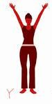

# Hump_Fix_Buddy

This is realtime Ai Pose Classifier I have created which will give a realtime prediciion for fixing Back Humpn Problem leveraging the YWTL posing system including a 15 seconds timer for each pose and a voice call for changing the poses.


## Google Mediapipe 

[Google Mediapipe](https://ai.google.dev/edge/mediapipe/solutions/guide)

You can read the Google Mediapipe library for more classification model and detection models.


## Check the My Buddy

Click the link  to let my Buddy help you fix your Hump -->[Hump_Fix_Buddy](https://ashzad123.github.io/Hump_Fix_Buddy/)

    
## Code Explanations

Below are the major code section of my WebApp ,you can go through the code.

**index.html** 

HTML code for using the video camera which can capture the video frame from the feed and can pass on to the classsifier.
    


```bash
<div class="title">
    <h1>Hump Fix Buddy</h1>
    <p>Follow the instructions to perform the poses correctly<p>
</div>
<div class="container">
    <canvas id="outputCanvas"></canvas>
    <div class="pose-guide">
        
        <h3 id="poseGuideLabel">Y Pose</h3>
    </div>
</div>
```

**script.js** 

Loading and Defining the model.

```bash
const pose = new Pose({
    locateFile: (file) => `https://cdn.jsdelivr.net/npm/@mediapipe/pose/${file}`,
});

pose.setOptions({
    modelComplexity: 1,
    smoothLandmarks: true,
    minDetectionConfidence: 0.3,
    minTrackingConfidence: 0.3
});

```
Camera Setup:

```bash
navigator.mediaDevices.getUserMedia({ video: true })
    .then((stream) => {
        videoElement.srcObject = stream;
        videoElement.play();

        videoElement.onloadedmetadata = () => {
            canvasElement.width = videoElement.videoWidth;
            canvasElement.height = videoElement.videoHeight;

            async function videoFrameProcessing() {
                await pose.send({ image: videoElement });
                requestAnimationFrame(videoFrameProcessing);
            }
            videoFrameProcessing();
        };
    }).catch((err) => {
        console.error("Error accessing the webcam: ", err);
    });
```
Pose Classification function:

```bash
function classifyPose(landmarks) {
    const leftElbowAngle = calculateAngle(landmarks[11], landmarks[13], landmarks[15]);
    const rightElbowAngle = calculateAngle(landmarks[12], landmarks[14], landmarks[16]);
    const leftShoulderAngle = calculateAngle(landmarks[13], landmarks[11], landmarks[23]);
    const rightShoulderAngle = calculateAngle(landmarks[14], landmarks[12], landmarks[24]);

    let label = 'Unknown Pose';

    // Y-Pose
    if ((leftElbowAngle > 120 && leftElbowAngle < 150) || (rightElbowAngle > 120 && rightElbowAngle < 150)) {
        if ((leftShoulderAngle > 115 && leftShoulderAngle < 150) || (rightShoulderAngle > 115 && rightShoulderAngle < 150)) {
            label = 'Y Pose';
        }
    }
    // W-Pose
    if ((leftElbowAngle > 50 && leftElbowAngle < 85) || (rightElbowAngle > 50 && rightElbowAngle < 85)) {
        if ((leftShoulderAngle > 55 && leftShoulderAngle < 100) || (rightShoulderAngle > 55 && rightShoulderAngle < 100)) {
            label = 'W Pose';
        }
    }
    // T-Pose
    if ((leftElbowAngle > 145 && leftElbowAngle < 200) || (rightElbowAngle > 145 && rightElbowAngle < 200)) {
        if ((leftShoulderAngle > 65 && leftShoulderAngle < 95) || (rightShoulderAngle > 65 && rightShoulderAngle < 95)) {
            label = 'T Pose';
        }
    }
    // L-Pose
    if ((leftElbowAngle > 90 && leftElbowAngle < 130) || (rightElbowAngle > 90 && rightElbowAngle < 130)) {
        if ((leftShoulderAngle > 15 && leftShoulderAngle < 45) || (rightShoulderAngle > 15 && rightShoulderAngle < 45)) {
            label = 'L Pose';
        }
    }

    const now = Date.now() / 1000; // Current time in seconds
    const expectedPose = poseSequence[currentPoseIndex];

    if (label !== 'Unknown Pose' && label === expectedPose) {
        if (!poseStartTime) {
            poseStartTime = now;
        }

        const elapsedTime = now - poseStartTime;
        const remainingTime = Math.max(0, poseDuration - elapsedTime);

        canvasCtx.font = "30px Arial";
        canvasCtx.fillStyle = "green";
        canvasCtx.fillText(`${label} - Time Left: ${Math.ceil(remainingTime)}s`, 10, 80);

        if (remainingTime === 0) {
            poseStartTime = null;
            currentPoseIndex = (currentPoseIndex + 1) % poseSequence.length;

            

            // Play an audio alert
            const audio = new Audio('audio/pose_change.mp3');
            audio.play();

            updatePoseGuide();
        }
    } else {
        poseStartTime = null;
    }

    canvasCtx.font = "30px Arial";
    canvasCtx.fillStyle = "green";
    canvasCtx.fillText(`Current Pose: ${expectedPose}`, 10, 40);
}
```
